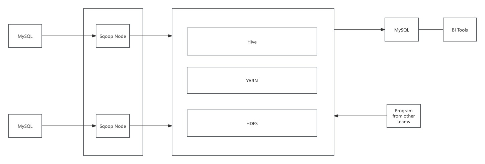
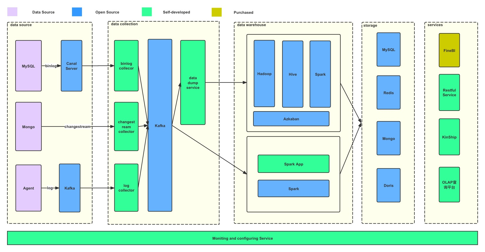

# Rebuilding a Failing Enterprise Data Platform

This document describes the system design and architecture of a production data platform, based on hands-on implementation and real-world system challenges.
The system design and architecture described here were primarily designed and implemented by myself during the project.

## Background
When I joined the team, my direct manager gave me a very explicit mandate:
- The platform was approaching a breaking point.
- If no fundamental redesign was delivered within six months, the data platform would no longer be viable for the business.

I was asked to independently investigate the root causes, propose a complete redesign plan, and validate its feasibility through production implementation. The success of the initiative would directly determine the future direction of the data platform — and my role in the company.
At that time, the entire data warehouse was batch-driven and had become a serious operational liability. The system relied on nightly Sqoop jobs to extract incremental data from production MySQL databases using modified-time filtering, then stored the data in a Hadoop + Hive cluster. Downstream DWD, DWS, DIM, and ADS layers were built through chained Hive SQL jobs orchestrated by scattered crontab scripts. After ADS tables were generated, data was pushed back into MySQL via Sqoop for BI reporting.

This architecture was fragile and opaque. The cluster experienced systemic failures every two to three days. Jobs frequently retried and failed, dashboards were delayed or unavailable, and both analytics and algorithm teams reported that their core work was being blocked by unreliable data delivery. Instead of enabling business decisions, the data platform had become a bottleneck.
A detailed audit revealed following critical issues:
- High latency: All metrics were produced on a T+1 basis, making real-time business monitoring impossible.
- No observability: There was no unified monitoring, alerting, or failure-diagnosis mechanism. Failures were discovered manually after reports were already broken.
- Unclear data ownership: Analysts depended on the warehouse team to push data, while algorithm teams queried Hive directly, blurring responsibility boundaries.
- Metric inconsistency: Different teams independently defined similar KPIs, resulting in duplicated pipelines and inconsistent executive metrics when business logic changed.
- Recurring cluster outages: The cluster suffered periodic unexplained crashes, causing company-wide data unavailability.
- Unbounded resource consumption: Core fact tables were rebuilt from full historical data every day. Single jobs monopolized cluster resources for hours, and this bottleneck worsened continuously as data volume and business requirements grew.

I was tasked with diagnosing the root causes and rebuilding the data platform into a stable, real-time, and governed system. After the redesigned platform had been running in production for nearly a year with sustained stability, my team lead was promoted and I was formally elevated to lead the Data Platform & Data Warehouse team as Director, reflecting the impact of the transformation.

## Foundational Architecture Principles
Before any technical refactoring began, I defined a set of non-negotiable platform objectives to guide the entire redesign.
1. Real-time as a First-Class Capability
The platform must support a real-time metric computation pipeline.
Batch processing alone was no longer acceptable for operational monitoring.
2. Deterministic Offline SLA
The offline data warehouse must consistently finish all core data production before 06:00 AM every day, enabling business and analytics teams to start work without delay.
3. Decoupled Source Systems
The platform must eliminate tight coupling between business databases and the data warehouse. It had to support database sharding and table splitting in online systems without breaking downstream pipelines.
4. Multi-Source Ingestion
The ingestion layer must support heterogeneous data sources, including non-relational data produced by online systems, not only traditional relational databases.
5. Eventual Consistency with At-Least-Once Semantics
Real-time metrics were allowed to have bounded temporary inaccuracies, but the system must support backfill and replay mechanisms to guarantee final correctness. The platform adopted an At-Least-Once delivery model with compensating reconciliation logic.
6. Clear Ownership Boundaries
The platform must clearly define responsibility boundaries between:
Data producers
Data platform
Data consumers (analytics, BI, algorithm teams)
No team should bypass the platform and directly query raw infrastructure.
7. Observability and Accountability
   Every pipeline, job, and service must be fully observable, with:
    - Real-time monitoring
    - Alerting on failure or SLA breach
    - Explicit ownership for every critical component

## Architecture Redesign
 

### Real-Time Pipeline – Kafka-Centric Decoupled Architecture
To break the tight coupling between online business systems and the data warehouse, I introduced a Kafka-centric event backbone as the foundation of the new real-time data platform.
A dedicated CDC service was developed as the Kafka producer, continuously capturing changes from transactional databases and publishing them into Kafka topics. This eliminated direct dependencies between source databases and downstream data processing jobs.
Two independent consumer groups were built on top of Kafka:
- Real-time processing consumers, responsible for streaming computation and near real-time metric generation.
- Offline ingestion consumers, specifically designed to persist Kafka events into the data warehouse as incremental fact data.

This design ensured that:
- Source systems no longer directly served analytical workloads.
- Real-time and offline pipelines were fully decoupled and could evolve independently.
- The platform could safely tolerate upstream schema changes, traffic spikes, and partial downstream failures without cascading system-wide impact.

###	Change Data Capture – Building a Reliable Ingestion Layer

To support heterogeneous data sources, three independent ingestion services were built:
- MySQL CDC based on Canal
- MongoDB CDC based on Change Streams
- Application log ingestion service for mobile apps and backend services

All incoming records were transformed into a unified JSON schema defined by the data platform team before being published into Kafka, ensuring downstream consumers could process data in a consistent format regardless of source system.

#### Handling Schema Evolution
Production databases were governed by a strict rule: **fields could be added but never removed or modified.**
When schema changes occurred:
- The CDC service captured DDL statements and emitted alert notifications.
- Real-time streaming jobs continued to operate normally because all existing fields were preserved.
- The offline ingestion service cached Hive table schemas and compared every incoming record with the current table definition.

To guarantee forward compatibility, each Hive fact table reserved a special column named unknown, used to store any unrecognized fields and their raw content.
After validation, engineers updated table definitions and ETL logic, extracting historical fields from the unknown column without any need for Kafka replay.

#### Backfill Without Replay
Because all unrecognized fields were already persisted in the data warehouse, historical data did not require re-consuming Kafka topics.
For offline pipelines, backfill was performed by:
- Updating Hive schemas
- Extracting historical values from the unknown column
For real-time pipelines, only new data was processed after service restart. Historical correction was handled by a one-time offline backfill task and then written back into real-time metric stores.

#### At-Least-Once Delivery Semantics
For MySQL CDC:
- Each binlog record contained a GTID
- After publishing events to Kafka, the CDC service periodically committed its consumer ID and last processed transaction ID into ZooKeeper.
- On restart, Canal resumed consumption from the last confirmed binlog position.

For MongoDB Change Streams:
- Resume tokens were committed after successful consumption, allowing precise recovery from any checkpoint.
- Using a combination of primary keys, Kafka offsets, and transaction identifiers, every record could be uniquely identified.
- Offline ETL performed de-duplication based on these identifiers.
- Real-time streaming jobs implemented idempotent processors to filter duplicate records.

A known edge case was a small duplication window during CDC restarts (approximately one minute). In rare situations — occurring once every one to two years — offline backfill was used to compensate for residual inconsistencies.

#### Ordering Guarantees
- MySQL binlog events were forced into strict order by limiting producer parallelism to one batch at a time, ensuring source-order consistency.
- MongoDB Change Stream events were allowed to be produced in parallel. Minor disorder was tolerated and handled by window-based processing in the real-time pipeline, preventing metric loss in most scenarios.

### Offline Pipeline Refactoring – Eliminating Full Rebuild Bottlenecks
The most destructive bottleneck in the legacy system was the daily full rebuild of core fact tables, which consumed the majority of cluster CPU and memory for hours and worsened continuously as data volume grew.
I redesigned the entire offline processing model around three core principles:
- partition specialization,
- hot–cold separation
- incremental merging

#### Partition Specialization – Trading Disk for Time
Instead of maintaining a single monolithic DWD fact table, I introduced multiple DWD tables with different partitioning strategies for the same ODS source.
For example, the order fact table was materialized into several DWD variants, partitioned by:
•	Order creation time
•	Settlement time
•	Completion time
Each downstream metric selected the most appropriate partition model, eliminating the need for expensive cross-time dimension scans and removing the “one-partition-fits-none” problem.
#### Hot–Cold SCD Model
Each DWD table adopted a two-level partition model:
|Partition|Meaning|
|:--|:--|
|Hot	|All active records representing the latest state|
|Cold	|Closed historical records with immutable status|

- Incoming ODS partitions were merged only with the relevant Hot partitions.
- Records whose state was finalized were moved into the Cold partition.
- Cold files were suffixed with the closing date, enabling efficient historical queries.

This transformed all daily processing into incremental SCD merges instead of full table rebuilds.
#### Incremental Recovery Without Full Reload
If rollback was required, the platform only needed to:
1.	Read the affected Cold partition files
2.	Merge them back into the corresponding Hot partitions
3.	Rewind the state by one business day
This made historical correction deterministic and safe without touching unrelated data.

#### System-Level Impact
With incremental partition merging and hot–cold data separation:
- Only partitions with real changes were recalculated.
- Historical data remained query-friendly and isolated from volatile data.
- CPU, memory usage, and job execution time were reduced by over 70%.

### Platform Observability
To eliminate blind spots in both batch and streaming pipelines, I designed a centralized Alerting & Notification Platform tightly integrated with the infrastructure team’s event notification services.

All alerts generated across the data platform — including offline ETL failures, SLA breaches, and real-time streaming anomalies — were standardized and routed through this platform.

Alert delivery was driven by severity-based policies and supported multiple notification channels:
- Company internal messaging groups for routine incidents
- SMS notifications for high-priority failures
- Automated voice calls for critical production outages

This ensured that every production issue was actively pushed to the responsible engineers in real time, rather than being discovered passively after business reports were already impacted.

#### Offline Jobs
While standardizing data warehouse development practices, I also fixed a critical SLA alerting bug in Azkaban 2.2 by patching its source code and implemented custom plugins to provide:
-  Job failure alerts
-  SLA delay alerts

#### Real-Time Jobs
All Spark Structured Streaming applications were integrated into the unified observability framework.

Each real-time job continuously reported the following runtime metrics:
- Processing delay and micro-batch latency
- Kafka offset lag per topic partition
- Failure rate and restart frequency

Threshold-based alert rules were defined for every production streaming job:
- Kafka lag exceeding SLA window
- Micro-batch latency breaching upper bounds
- Repeated job restarts within a fixed time window

When any threshold was violated, alerts were actively pushed to on-call engineers through SMS and automated voice calls, ensuring that streaming incidents were detected and responded to within minutes.

#### CDC Program

All CDC ingestion services were also integrated into the alerting framework.
The platform actively monitored:
- DDL change events, triggering schema-change alerts whenever production table structures were modified
- Data publishing and consumption failures, including Kafka produce/consume exceptions
- JVM health indicators, such as abnormal process termination and long-duration GC pauses

The infrastructure team provided runtime monitoring support for Java services, enabling automatic alerts on service crashes and prolonged garbage collection events.
By extending observability to the ingestion layer itself, failures could be detected at the earliest point in the data pipeline, preventing silent data loss from propagating into downstream systems.

## Business Impact & Measurable Results

The redesigned platform fundamentally changed how the company consumed and trusted data.

|Metric|Before|After|
|:--|:--|:--|
|Key metric latency|	T+1 day	|30 seconds – 5 minutes (window-based streaming)|
|Cluster stability|	System crashs every 3–4 days|One planned maintenance window per year|
|Offline SLA|Unpredictable completion, frequent full-cluster blockage|100% daily completion before 06:00 AM|
|Resource utilization|Near 100% CPU / memory for several hours every night|Reduced to ~40% sustained usage|
|Data accuracy|Inconsistent KPIs across teams|Fully aligned with financial system results|
|Incident response|Issues discovered after reports failed|Real-time detection and resolution by data platform team|

By persisting every data change event and unifying real-time and offline reconciliation mechanisms, the platform achieved financial-grade data accuracy. In later stages, the data platform became the authoritative source for explaining discrepancies identified by the finance department.

## My Role & Key Contributions

Throughout the platform transformation, my responsibilities evolved from hands-on engineering to system-level leadership.

### Early Phase – Core Ingestion Foundation
In the initial stage, I personally designed and developed the full CDC ingestion stack, including:
- MySQL Binlog ingestion service
- MongoDB Change Stream ingestion service
- Application log collector for mobile apps and backend services
- Data dump service for offline warehouse ingestion

These components formed the backbone of the Kafka-centric decoupling architecture and enabled both real-time and offline pipelines to be built on top of a unified ingestion layer.

### Growth Phase – Platform-Level Ownership
As the platform stabilized and my role expanded, I focused primarily on:
- Reviewing and designing real-time and offline processing requirements, ensuring alignment with platform standards and long-term maintainability.
- Defining requirements and conducting design reviews for the alerting and configuration platform, ensuring reliability and operational accountability.
- Tracking and resolving issues in open-source components, including:
  - Fixing SLA alerting logic bugs and developing custom plugins for Azkaban
  - Investigating memory leak issues in Hive Metastore and coordinating remediation strategies

## Lessons Learned

### Responsibility Boundaries Are a Production Requirement
In a multi-team environment, unclear ownership is not just a management problem — it becomes a direct technical risk.
We once traced repeated Hive Metastore crashes to dozens of Docker-based algorithm services directly querying Hive with long-lived connection pools, eventually causing JVM GC failure. This incident made it clear that platform access boundaries must be enforced at the architectural level, not left to team conventions.

### Documentation Is Part of the System, not a Byproduct
Every stage — requirement analysis, design, testing, deployment, and operations — must be documented.
Documentation is not for formality; it is the only reliable mechanism for knowledge transfer, incident traceability, and safe system evolution.

### Most Engineering Work Happens in Failure Paths
Over 70% of production engineering complexity lies in exception handling, not the happy path.
During design reviews, failure scenarios, fallback logic, and edge cases must receive more attention than normal execution flows.

### Distributed Systems Demand Defensive Interaction Patterns
In cross-team integrations, success-path APIs are insufficient.
Timeouts, circuit breakers, and rate limiting must be explicitly designed, reviewed, and tested, or system failures will inevitably cascade.

### Observability Must Be Designed on Day One
Alerting and monitoring are not add-ons.
If failures are not detected automatically and routed to accountable owners, even the most elegant architecture will degrade into operational chaos.

### Production Operations Require Full Rehearsal
All manual production operations must be rehearsed in multiple test environments, including:
- Forward execution steps
- Verification checkpoints for every step
- Rollback procedures and rollback verification

Both the operator (DevOps) and the requester (engineering / QA) must participate in these rehearsals.

## No One Operates Production Alone
All production changes must be executed strictly according to written runbooks, with at least two people present:
- One performing the operation
- One independently verifying each step

This rule alone prevented more incidents than any single technical optimization.

