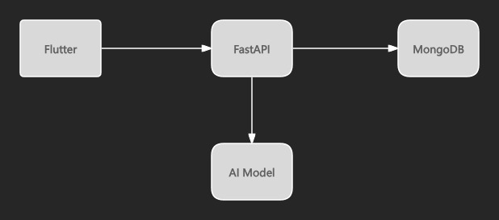
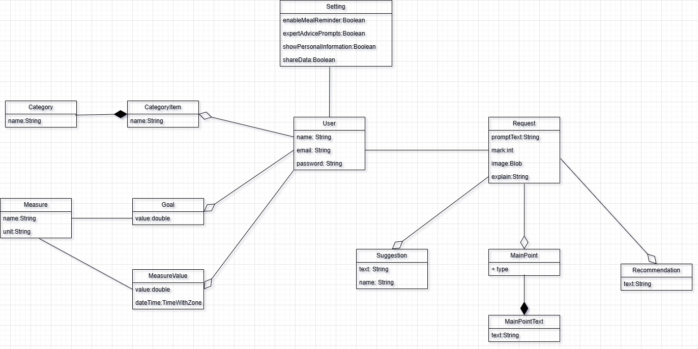
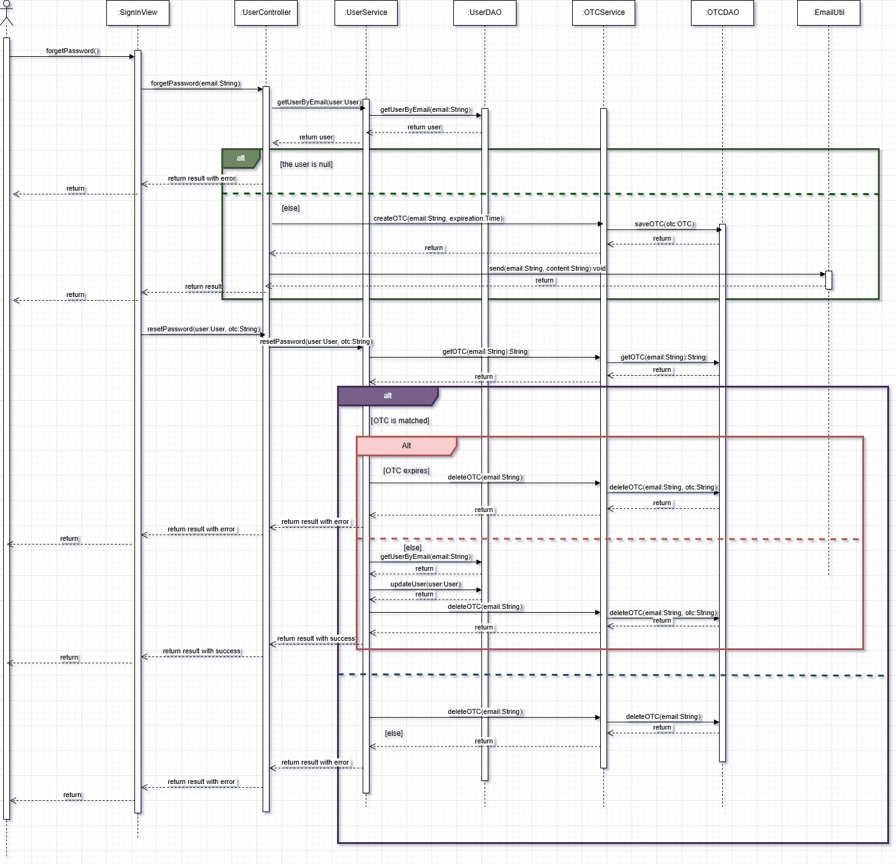
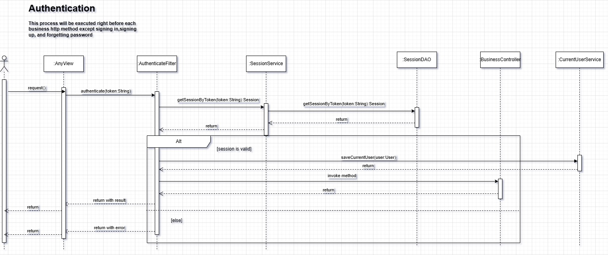
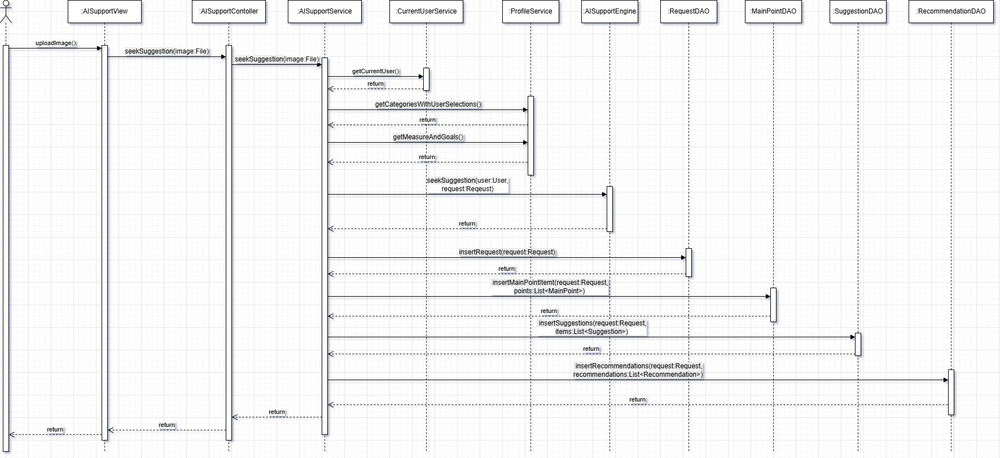

# Nutri Pilot – AI-powered Nutrition Planning Platform

Nutri Pilot is a full-stack SaaS platform that helps fitness studios and wellness coaches generate personalized meal plans and track client nutrition compliance.

## Live Demo 

- Demo: https://www.youtube.com/watch?v=PpI3tH1lzD8
- GitHub Repo: 
  - https://github.com/tie0913/nuitri_pilot_frontend
  - https://github.com/tie0913/nuitri_pilot_backend
  - https://github.com/tie0913/mongo-replicaset-signalnode

## Tech Stack

| Layer | Technology |
|------|------------|
| Backend | FastAPI (async)|
| Database | MongoDB |
| Frontend | Flutter |
| Deployment | Docker Compose |

## System Architecture

## Unified Domain Model

This diagram represents the core business entities of Nutri Pilot and how they interact
to support user management, nutrition tracking, and AI-powered advice generation.

Rather than focusing on infrastructure-level concerns, the model captures the essential
domain concepts required for the current MVP stage.

### Design Highlights

- **User** is the central aggregate root, connecting preferences, goals, health measures,
  and all AI-generated content.
- **Measure** and **MeasureValue** are separated to support historical data tracking
  without duplicating measurement definitions.
- **Request**, **Suggestion**, and **Recommendation** form a clear pipeline from
  raw user input to actionable advice.
- **Setting** is modeled as a lightweight extension to the user profile to isolate
  feature configuration from core business logic.

This unified domain model serves as the foundation for all key workflows,
including authentication, password recovery, and AI-powered recommendation generation.

## Core Workflow & Design Decisions

Before implementation, I designed key system workflows to ensure security, scalability, and maintainability.
Only the most critical flows are documented here.

### 1. Reset Password – Secure Identity Recovery

**Why this matters**

- Prevents user enumeration attacks  
- OTP is single-use and deleted immediately after validation  
- Expired OTP is cleaned up automatically to avoid replay attacks  

---

### 2. Authentication Filter – Centralized Trust Boundary

**Why this matters**

- Authentication logic is decoupled from business controllers  
- All protected endpoints share a single trust boundary  
- Invalid sessions never reach business logic  

---

### 3. Getting Advice from AI – Core Business Pipeline

**Why this matters**

- Isolates AI inference from user request lifecycle  
- Enables async execution and future queue-based scaling  
- Allows caching of generated advice for cost optimization

## Key Engineering Challenges

### Context Handling in AI Interaction

Nutri Pilot does not maintain long-lived AI sessions.

Instead, only the user’s chronic conditions and allergy information are stored as
structured fields in the database.

When the user submits a food image, these fields are sent together with the image
to the AI model. This avoids keeping long conversational context in memory and keeps
the backend stateless.

### Image Handling Strategy

When a user uploads a food image, the system generates two derived versions:

- A compressed image optimized for AI inference to reduce token usage  
- A thumbnail image stored in MongoDB (planned to be migrated to a file server) for
  displaying user history

This approach reduces AI cost while keeping the UI responsive.

## My Contributions
- Designed system architecture from scratch
- Implemented frontend application and backend services
- Deployed the platform using Docker
